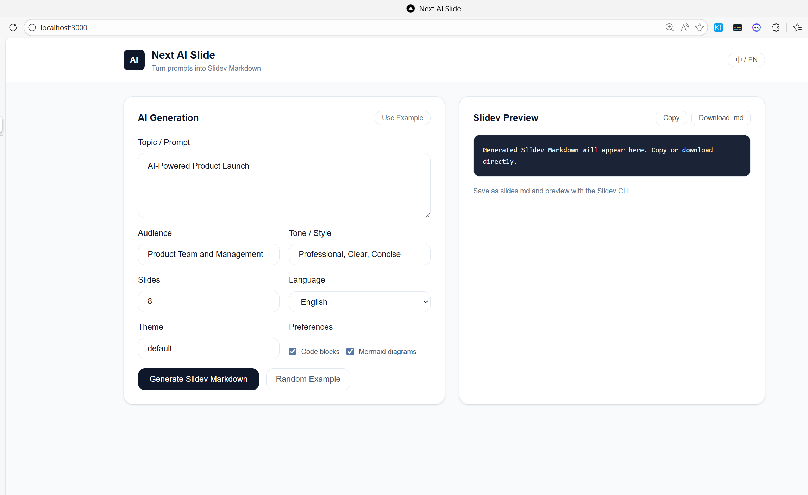

## Next AI Slide

[中文 README](./README.zh-CN.md)

AI-powered Slidev Markdown generator. Turn natural language prompts into Slidev slides with copy/download support.



## Quick Start

### 1) Install dependencies

```bash
npm install
```

### 2) Configure environment variables (optional)

Create `.env.local` and set:

```bash
OPENAI_API_KEY=你的 OpenAI Key
OPENAI_MODEL=gpt-4o-mini
OPENAI_BASE_URL=https://api.openai.com/v1
```

If no key is set, the API returns a local fallback template.

### 3) Run the dev server

```bash
npm run dev
# or
yarn dev
# or
pnpm dev
# or
bun dev
```

Open [http://localhost:3000](http://localhost:3000) in your browser.

Main UI: `src/app/page.tsx`，API: `src/app/api/generate/route.ts`.

This project uses [`next/font`](https://nextjs.org/docs/app/building-your-application/optimizing/fonts) to automatically optimize and load [Geist](https://vercel.com/font), a new font family for Vercel.

## Deployment

### Vercel

Deploy on Vercel and set `OPENAI_API_KEY` in environment variables.

### Other platforms

```bash
npm run build
npm run start
```

## Notes

- Uses the OpenAI API by default and can be extended to other models.
- Output is standard Slidev Markdown. Save as `slides.md` for Slidev preview.

## Roadmap

1. Integrate Slidev CLI for real-time preview
2. One-sentence PPT generation (Prompt → Slidev Markdown → Live preview)
3. Paste a GitHub repo URL to generate PPT
   - Reuse the repo fetching flow from [github-agent](https://github.com/lvy010/github-agent)
   - Summarize/structure content before generating Slidev Markdown
   - Live preview via Slidev CLI
4. Fine-tune a Slidev-specific LLM to improve PPT quality and fit
